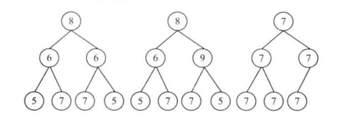

<!--
 * @Date: 2022-04-13 19:43:01
 * @LastEditors: 赵聪
 * @LastEditTime: 2022-04-13 20:16:06
 * @FilePath: /leetCode/树/对称二叉树/README.md
-->

## 对称二叉树
#### 请实现一个函数，用来判断一颗二叉树是不是对称的。注意，如果一个二叉树同此二叉树的镜像是同样的，定义其为对称的。



如图，1为对称二叉树，2、3都不是。

思路：
  1.两个子树根节点值相同
  2.左边的子树的左节点等于右边的子树的右节点
  2.左边的子树的右节点等于右边的子树的左节点

```javascript
function isSymmetrical(root: TreeNode<number>): boolean {
  return isSymmetricalTree(root.left, root.right);
}
function isSymmetricalTree(l: TreeNode<number>, r: TreeNode<number>) {
  return (
    l?.data === r?.data &&
    isSymmetricalTree(l.left, r.right) &&
    isSymmetricalTree(l.right, r.left)
  );
}
```
#### 操作给定的二叉树，将其变换为源二叉树的镜像。
```
  源二叉树 
    	    8
    	   /  \
    	  6   10
    	 / \  / \
    	5  7 9 11
  镜像二叉树
            8
          /  \
        10    6
        / \  / \
      11  9 7   5 
```
```javascript
export function Mirror(root: TreeNode<number>) {
  if(root){
    [root.left,root.right] = [root.right,root.left]
    Mirror(root.left)
    Mirror(root.right)
  }
}

```